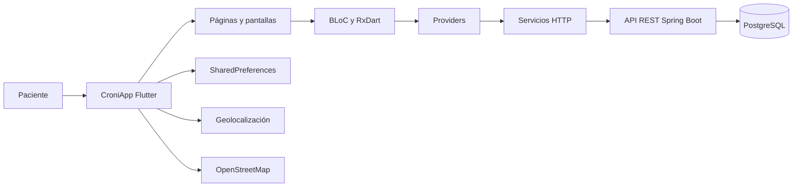

# 🏥 CroniApp — Aplicación móvil de seguimiento de pacientes


**CroniApp** es una aplicación móvil desarrollada con **Flutter** para el registro y seguimiento remoto de pacientes.

La aplicación permite que los usuarios administren sus datos personales, completen formularios relacionados con su estado de salud, consulten sus respuestas anteriores, localicen hospitales cercanos y se comuniquen con profesionales de la salud.

El proyecto fue desarrollado originalmente en el contexto de la pandemia de COVID-19 y forma parte del ecosistema **CroniWeb**.

---

## 📋 Tabla de contenidos

- [Descripción del proyecto](#-descripción-del-proyecto)
- [Características](#-características)
- [Módulos principales](#-módulos-principales)
- [Arquitectura](#️-arquitectura)
- [Tecnologías utilizadas](#️-tecnologías-utilizadas)
- [Requisitos previos](#-requisitos-previos)
- [Instalación](#-instalación)
- [Configuración del backend](#️-configuración-del-backend)
- [Permisos de la aplicación](#-permisos-de-la-aplicación)
- [Ejecución](#-ejecución)
- [Compilación para producción](#-compilación-para-producción)
- [Estructura del proyecto](#-estructura-del-proyecto)
- [Autenticación](#-autenticación)
- [Integración con la API](#-integración-con-la-api)
- [Mapas y geolocalización](#️-mapas-y-geolocalización)
- [Internacionalización](#-internacionalización)
- [Pruebas y calidad de código](#-pruebas-y-calidad-de-código)
- [Consideraciones de seguridad](#-consideraciones-de-seguridad)
- [Problemas conocidos](#️-problemas-conocidos)
- [Contribuciones](#-contribuciones)
- [Autores](#-autores)
- [Proyectos relacionados](#-proyectos-relacionados)
- [Agradecimientos](#-agradecimientos)
- [Soporte](#-soporte)

---

## 📋 Descripción del proyecto

CroniApp es el componente móvil del sistema de monitoreo y seguimiento de pacientes **CroniWeb**.

La aplicación consume una API REST desarrollada con Spring Boot y permite que el paciente interactúe con el sistema desde un dispositivo móvil.

Entre sus principales funciones se encuentran:

- Registro e inicio de sesión.
- Recuperación de contraseña.
- Gestión de información personal.
- Registro de ubicación geográfica.
- Visualización de hospitales cercanos.
- Consulta y realización de formularios.
- Visualización del historial de respuestas.
- Comunicación mediante mensajes.
- Persistencia local de la sesión.

---

## ✨ Características

### 🔐 Autenticación de usuarios

- Registro de una nueva cuenta.
- Inicio de sesión mediante correo y contraseña.
- Recuperación de contraseña.
- Persistencia local del token de autenticación.
- Recuperación automática de la sesión.
- Cierre de sesión.

### 👤 Gestión del perfil

- Consulta de los datos personales.
- Actualización de nombres y apellidos.
- Registro del número de documento.
- Registro del número de teléfono.
- Selección de fecha de nacimiento.
- Selección de sexo.
- Registro de dirección.
- Selección de departamento o provincia.
- Registro de coordenadas geográficas.

### 📋 Formularios de seguimiento

- Consulta de formularios disponibles.
- Formularios dinámicos con preguntas de salud.
- Registro de síntomas y estado general.
- Envío de respuestas al backend.
- Seguimiento remoto de la información registrada.

### 📊 Historial de respuestas

- Consulta de formularios completados.
- Visualización de respuestas anteriores.
- Seguimiento de la evolución del paciente.

### 🗺️ Hospitales y geolocalización

- Visualización de hospitales en un mapa.
- Uso de mapas de OpenStreetMap.
- Visualización de la ubicación del paciente.
- Marcadores diferenciados para pacientes y hospitales.
- Selección de ubicación mediante GPS.

### 💬 Mensajería

- Acceso al módulo de mensajes.
- Comunicación entre el paciente y los profesionales de salud.
- Consulta de mensajes relacionados con el seguimiento.

### 🌍 Localización

- Configuración base para español.
- Configuración base para inglés.
- Compatibilidad con los componentes localizados de Flutter.

> [!NOTE]
> La aplicación incluye configuración para español e inglés. Para una internacionalización completa, los textos propios de la aplicación deben centralizarse y traducirse mediante archivos de localización.

---

## 📱 Módulos principales

La navegación principal de CroniApp contiene los siguientes módulos:

| Módulo | Descripción |
|---|---|
| **Datos** | Consulta y actualización de la información personal |
| **Formularios** | Visualización y realización de cuestionarios |
| **Respuestas** | Consulta del historial de formularios completados |
| **Hospitales** | Visualización de hospitales y ubicación del paciente |
| **Mensajes** | Comunicación con el personal de salud |

---

## 🏗️ Arquitectura

CroniApp utiliza una arquitectura basada en componentes, proveedores y flujos reactivos.



### Flujo general

1. El usuario interactúa con una pantalla de Flutter.
2. La pantalla ejecuta una operación mediante un proveedor o servicio.
3. El servicio realiza una solicitud HTTP a la API REST.
4. El backend procesa la información.
5. La respuesta se transforma en un modelo de Dart.
6. La interfaz muestra el resultado al usuario.
7. El token de sesión se conserva localmente mediante `SharedPreferences`.

---

## 🛠️ Tecnologías utilizadas

| Tecnología | Versión declarada | Uso |
|---|---:|---|
| Flutter | `>= 2.0.0` | Desarrollo multiplataforma |
| Dart | `>= 2.12.0 < 4.0.0` | Lenguaje principal |
| Java | `17` | Compilación de Android |
| Android Compile SDK | `36` | Compilación Android |
| Android Target SDK | `36` | Versión objetivo de Android |
| RxDart | `0.27.7` | Programación reactiva y BLoC |
| HTTP | `1.1.0` | Comunicación con la API REST |
| Shared Preferences | `2.5.4` | Persistencia local |
| Flutter Map | `6.1.0` | Visualización de mapas |
| LatLong2 | `0.9.1` | Manejo de coordenadas |
| Geolocator | `10.1.0` | Acceso a la ubicación |
| Intl | `0.20.2` | Formateo de fechas y localización |
| Flutter Localizations | SDK de Flutter | Localización de componentes |
| OpenStreetMap | Servicio externo | Proveedor de mapas |
| Railway | Servicio externo | Alojamiento del backend |

### Dependencias principales

```yaml
dependencies:
  flutter:
    sdk: flutter

  flutter_localizations:
    sdk: flutter

  cupertino_icons: ^1.0.0
  rxdart: ^0.27.7
  http: ^1.1.0
  shared_preferences: ^2.5.4
  intl: ^0.20.2
  flutter_map: ^6.1.0
  latlong2: ^0.9.1
  geolocator: ^10.1.0
```

---

## 📦 Requisitos previos

### Requisitos generales

Antes de ejecutar el proyecto, asegurate de tener instalado:

- [Git](https://git-scm.com/downloads).
- [Flutter SDK](https://docs.flutter.dev/get-started/install).
- Dart SDK incluido con Flutter.
- Un editor compatible:
    - Android Studio.
    - IntelliJ IDEA.
    - Visual Studio Code.
- Acceso al backend de CroniWeb.

### Para Android

- Java JDK 17.
- Android Studio.
- Android SDK.
- Android SDK Platform 36.
- Un emulador configurado o un dispositivo físico.
- Depuración USB habilitada, en caso de utilizar un dispositivo físico.

### Para iOS

- Una computadora con macOS.
- Xcode.
- CocoaPods.
- Un simulador de iOS o un dispositivo físico.
- Una cuenta de desarrollador de Apple para distribuir la aplicación.

### Verificar la instalación

```bash
flutter --version
dart --version
java -version
flutter doctor
```

Para obtener un diagnóstico más detallado:

```bash
flutter doctor -v
```

> [!IMPORTANT]
> Aunque el archivo `pubspec.yaml` declara compatibilidad desde Flutter 2.0, se recomienda utilizar una versión estable de Flutter que sea compatible con las versiones actuales de las dependencias.

---

## 🚀 Instalación

### 1. Clonar el repositorio

```bash
git clone https://github.com/dgomezrocket/covid19-app.git
cd covid19-app
```

### 2. Descargar las dependencias

```bash
flutter pub get
```

### 3. Verificar la configuración

```bash
flutter doctor
```

### 4. Consultar los dispositivos disponibles

```bash
flutter devices
```

### 5. Limpiar compilaciones anteriores, cuando sea necesario

```bash
flutter clean
flutter pub get
```

---

## ⚙️ Configuración del backend

La URL del backend se encuentra actualmente configurada en:

```text
lib/src/utils/config.dart
```

Configuración utilizada:

```dart
final baseUrl =
    'https://backend-core-covid19-production.up.railway.app';
```

### Backend en producción

```dart
final baseUrl =
    'https://backend-core-covid19-production.up.railway.app';
```

### Backend local desde Android Emulator

Cuando el backend se ejecuta en la misma computadora, el emulador de Android puede acceder al equipo anfitrión mediante `10.0.2.2`:

```dart
final baseUrl = 'http://10.0.2.2:9900';
```

### Backend local desde un dispositivo físico

Utilizá la dirección IP local de la computadora:

```dart
final baseUrl = 'http://192.168.1.100:9900';
```

El teléfono y la computadora deben estar conectados a la misma red.

> [!IMPORTANT]
> No agregues una barra `/` al final de `baseUrl` si los servicios ya construyen los endpoints comenzando con `/`.

> [!NOTE]
> Luego de cambiar la URL, reiniciá completamente la aplicación. Un hot reload puede no ser suficiente para aplicar todos los cambios de configuración.

### Mejora recomendada

Para evitar modificar el código en cada ambiente, se recomienda posteriormente utilizar `--dart-define`.

Ejemplo de ejecución:

```bash
flutter run \
  --dart-define=API_URL=https://backend-core-covid19-production.up.railway.app
```

Para utilizar esa estrategia, la configuración podría adaptarse así:

```dart
const baseUrl = String.fromEnvironment(
  'API_URL',
  defaultValue:
      'https://backend-core-covid19-production.up.railway.app',
);
```

---

## 🔏 Permisos de la aplicación

CroniApp necesita conexión a Internet y acceso a la ubicación del dispositivo.

### Android

Verificá que `android/app/src/main/AndroidManifest.xml` contenga los permisos necesarios:

```xml
<uses-permission android:name="android.permission.INTERNET" />
<uses-permission android:name="android.permission.ACCESS_COARSE_LOCATION" />
<uses-permission android:name="android.permission.ACCESS_FINE_LOCATION" />
```

Los permisos deben declararse antes de la etiqueta `<application>`:

```xml
<manifest xmlns:android="http://schemas.android.com/apk/res/android">

    <uses-permission android:name="android.permission.INTERNET" />
    <uses-permission android:name="android.permission.ACCESS_COARSE_LOCATION" />
    <uses-permission android:name="android.permission.ACCESS_FINE_LOCATION" />

    <application
        android:label="CroniApp"
        android:name="${applicationName}"
        android:icon="@mipmap/ic_launcher">

        <!-- Configuración de la aplicación -->

    </application>
</manifest>
```

### iOS

En `ios/Runner/Info.plist`, agregá una explicación para el uso de la ubicación:

```xml
<key>NSLocationWhenInUseUsageDescription</key>
<string>
CroniApp utiliza tu ubicación para mostrar hospitales cercanos.
</string>
```

> [!IMPORTANT]
> La aplicación debe solicitar los permisos en tiempo de ejecución y manejar los casos en que el usuario los rechace o desactive el GPS.

---

## 🏃 Ejecución

### Ejecutar en modo debug

```bash
flutter run
```

### Seleccionar un dispositivo

Primero consultá los dispositivos disponibles:

```bash
flutter devices
```

Luego ejecutá la aplicación indicando el identificador:

```bash
flutter run -d ID_DEL_DISPOSITIVO
```

Ejemplo para un emulador Android:

```bash
flutter run -d emulator-5554
```

### Ejecutar en Android

```bash
flutter run -d android
```

### Ejecutar en iOS

```bash
flutter run -d ios
```

### Ejecutar con información detallada

```bash
flutter run -v
```

### Recarga durante el desarrollo

Mientras `flutter run` está activo:

| Tecla | Acción |
|---|---|
| `r` | Hot reload |
| `R` | Hot restart |
| `q` | Detener la aplicación |
| `h` | Mostrar ayuda |

---

## 📦 Compilación para producción

### Generar APK

```bash
flutter build apk --release
```

El archivo se generará normalmente en:

```text
build/app/outputs/flutter-apk/app-release.apk
```

### Generar APK separados por arquitectura

```bash
flutter build apk --split-per-abi
```

Esto genera archivos separados para las diferentes arquitecturas del dispositivo.

### Generar Android App Bundle

Formato recomendado para Google Play:

```bash
flutter build appbundle --release
```

El archivo se generará normalmente en:

```text
build/app/outputs/bundle/release/app-release.aab
```

### Compilar para iOS

```bash
flutter build ios --release
```

### Actualizar la versión

La versión de la aplicación se define en `pubspec.yaml`:

```yaml
version: 1.0.0+1
```

Donde:

- `1.0.0` corresponde a la versión visible.
- `1` corresponde al número interno de compilación.

Ejemplo:

```yaml
version: 1.1.0+2
```

> [!WARNING]
> Antes de publicar la aplicación en Google Play, configurá una clave de firma de producción. La configuración de desarrollo no debe utilizarse para distribuir una versión oficial.

---

## 📂 Estructura del proyecto

```text
covid19-app/
├── android/                         # Configuración y compilación para Android
├── ios/                             # Configuración y compilación para iOS
├── web/                             # Configuración para Flutter Web
│
├── lib/
│   ├── src/
│   │   ├── blocs/                   # Lógica reactiva y patrón BLoC
│   │   ├── mixins/                  # Comportamientos reutilizables
│   │   ├── models/                  # Modelos de datos
│   │   ├── pages/                   # Módulos principales
│   │   │   ├── profile_page.dart    # Datos personales
│   │   │   ├── forms_page.dart      # Formularios disponibles
│   │   │   ├── answers_page.dart    # Historial de respuestas
│   │   │   ├── map_page.dart        # Mapa de hospitales
│   │   │   └── message_page.dart    # Mensajería
│   │   │
│   │   ├── providers/               # Acceso y transformación de datos
│   │   ├── screens/                 # Pantallas y navegación
│   │   │   ├── home_screen.dart
│   │   │   ├── login_screen.dart
│   │   │   ├── signup_screen.dart
│   │   │   └── forgot_password.dart
│   │   │
│   │   ├── services/                # Autenticación y servicios HTTP
│   │   ├── utils/                   # Configuración, rutas y utilidades
│   │   │   ├── config.dart          # URL base del backend
│   │   │   ├── routes.dart          # Rutas de la aplicación
│   │   │   └── widgets.dart         # Widgets reutilizables
│   │   │
│   │   └── app.dart                 # Configuración de MaterialApp
│   │
│   └── main.dart                    # Punto de entrada
│
├── test/                            # Pruebas automatizadas
├── pubspec.yaml                     # Dependencias y metadatos
├── pubspec.lock                     # Versiones resueltas
└── README.md
```

### Descripción de los directorios principales

| Directorio | Responsabilidad |
|---|---|
| `blocs` | Administración reactiva del estado |
| `mixins` | Funciones compartidas entre clases |
| `models` | Representación de entidades y respuestas |
| `pages` | Módulos accesibles desde la navegación principal |
| `providers` | Comunicación entre la interfaz y los servicios |
| `screens` | Pantallas principales y autenticación |
| `services` | Solicitudes HTTP y manejo de sesión |
| `utils` | Configuración, constantes, rutas y widgets |
| `test` | Pruebas unitarias y de widgets |

---

## 🔐 Autenticación

CroniApp utiliza una API REST para registrar y autenticar usuarios.

### Registro

```http
POST /accounts/signup
```

Ejemplo del cuerpo de la solicitud:

```json
{
  "email": "usuario@ejemplo.com",
  "password": "contraseña"
}
```

### Inicio de sesión

```http
POST /authentication/authenticate
```

Ejemplo:

```json
{
  "email": "usuario@ejemplo.com",
  "password": "contraseña"
}
```

### Almacenamiento del token

Después del inicio de sesión, el token se guarda localmente utilizando `SharedPreferences`.

Flujo general:

```text
Inicio de sesión
      ↓
API REST valida las credenciales
      ↓
El backend devuelve un token
      ↓
CroniApp guarda el token localmente
      ↓
El token se utiliza en solicitudes protegidas
```

### Cierre de sesión

Al cerrar sesión, la aplicación elimina la información almacenada localmente y redirige al usuario hacia la pantalla de inicio de sesión.

---

## 🔌 Integración con la API

La aplicación se comunica con el backend mediante el paquete `http`.

### Recursos principales

| Método | Endpoint | Descripción |
|---|---|---|
| `POST` | `/accounts/signup` | Registrar una cuenta |
| `POST` | `/authentication/authenticate` | Iniciar sesión |
| `POST` | `/accounts/send-email` | Solicitar recuperación de contraseña |
| `GET` | `/persons` | Consultar información del paciente |
| `PUT` | `/persons` | Actualizar información personal |
| `GET` | `/forms` | Consultar formularios |
| `GET` | `/answers` | Consultar respuestas |
| `POST` | `/answers` | Enviar respuestas |
| `GET` | `/hospitals/my` | Consultar hospitales cercanos |
| `GET` | `/messages` | Consultar mensajes |
| `POST` | `/messages` | Enviar un mensaje |

Para los endpoints protegidos, el token debe enviarse en la cabecera correspondiente:

```http
Authorization: Bearer TOKEN_JWT
```

Ejemplo conceptual en Dart:

```dart
final response = await http.get(
  Uri.parse('$baseUrl/persons'),
  headers: {
    'Content-Type': 'application/json',
    'Authorization': 'Bearer $token',
  },
);
```

---

## 🗺️ Mapas y geolocalización

CroniApp utiliza:

- `flutter_map` para representar el mapa.
- `latlong2` para administrar las coordenadas.
- `geolocator` para obtener la posición.
- OpenStreetMap como proveedor de mosaicos.

El mapa utiliza una URL similar a:

```text
https://{s}.tile.openstreetmap.org/{z}/{x}/{y}.png
```

### Marcadores

La aplicación diferencia visualmente:

- La ubicación del paciente.
- La ubicación de los hospitales.

### Uso responsable de OpenStreetMap

Al publicar la aplicación:

- Mantené visible la atribución correspondiente a OpenStreetMap.
- Evitá realizar descargas masivas de mosaicos.
- Revisá la política de uso del proveedor.
- Considerá utilizar un proveedor especializado para ambientes de alta demanda.

---

## 🌍 Internacionalización

La aplicación configura las siguientes localizaciones:

```dart
supportedLocales: [
  const Locale('en', 'US'),
  const Locale('es', 'ES'),
]
```

También utiliza los delegados de localización de Flutter:

```dart
localizationsDelegates: [
  GlobalMaterialLocalizations.delegate,
  GlobalWidgetsLocalizations.delegate,
  GlobalCupertinoLocalizations.delegate,
]
```

Esto localiza elementos propios de Flutter, como:

- Calendarios.
- Selectores de fecha.
- Botones del sistema.
- Componentes Material.
- Componentes Cupertino.

> [!NOTE]
> Para traducir todos los textos propios de CroniApp se recomienda utilizar archivos ARB y `flutter gen-l10n`.

---

## 🧪 Pruebas y calidad de código

### Ejecutar todas las pruebas

```bash
flutter test
```

### Ejecutar pruebas con cobertura

```bash
flutter test --coverage
```

El reporte se generará en:

```text
coverage/lcov.info
```

### Analizar el código

```bash
flutter analyze
```

### Aplicar formato

```bash
dart format .
```

### Verificar si el código necesita formato

```bash
dart format --output=none --set-exit-if-changed .
```

### Actualizar dependencias compatibles

```bash
flutter pub upgrade
```

### Consultar dependencias desactualizadas

```bash
flutter pub outdated
```

---

## 🔒 Consideraciones de seguridad

### Token de autenticación

La implementación actual utiliza `SharedPreferences` para conservar el token.

`SharedPreferences` es apropiado para configuraciones simples, pero no proporciona almacenamiento cifrado específico para credenciales.

Para una versión de producción se recomienda evaluar:

```yaml
dependencies:
  flutter_secure_storage: ^9.0.0
```

Esto permitiría almacenar el token utilizando mecanismos seguros del sistema operativo.

### Información sensible

No guardes dentro del código:

- Contraseñas.
- Claves privadas.
- Credenciales de bases de datos.
- Tokens permanentes.
- Contraseñas SMTP.
- Credenciales administrativas.

La URL pública del backend puede formar parte de la aplicación, pero los secretos deben permanecer exclusivamente en el servidor.

### HTTPS

En producción, todas las solicitudes deben utilizar:

```text
https://
```

Esto ayuda a proteger la información durante la comunicación entre la aplicación y el backend.

---

## ⚠️ Problemas conocidos

### 1. La versión de Java no es compatible

Mensaje frecuente:

```text
Your project's Java version is lower than Flutter's minimum supported version.
```

Verificá la versión:

```bash
java -version
```

El proyecto utiliza Java 17.

Para configurar Flutter con una instalación específica:

```bash
flutter config --jdk-dir="C:\ruta\a\jdk-17"
```

En Linux o macOS:

```bash
flutter config --jdk-dir="/ruta/a/jdk-17"
```

Después ejecutá:

```bash
flutter doctor -v
```

### 2. No llegan los correos de registro o recuperación

El envío de correos depende del backend.

Verificá:

- Configuración SMTP.
- Usuario del servidor de correo.
- Contraseña de aplicación.
- Variables de entorno de Railway.
- Registros del backend.
- Carpeta de spam del destinatario.

### 3. La aplicación no se conecta al backend

Comprobá:

- Que la URL configurada sea correcta.
- Que el backend esté activo.
- Que el dispositivo tenga acceso a Internet.
- Que el backend utilice HTTPS.
- Que el token sea válido.
- Que la URL no tenga una barra duplicada.

Configuración actual:

```dart
final baseUrl =
    'https://backend-core-covid19-production.up.railway.app';
```

### 4. No se obtiene la ubicación

Verificá:

- Que el GPS esté activado.
- Que la aplicación tenga permisos.
- Que el usuario no haya rechazado permanentemente el permiso.
- Que el emulador tenga una ubicación configurada.
- Que `AndroidManifest.xml` e `Info.plist` estén correctamente configurados.

### 5. El mapa aparece vacío

Comprobá:

- La conexión a Internet.
- La respuesta del endpoint de hospitales.
- Las coordenadas del paciente.
- Las coordenadas de los hospitales.
- El acceso al servidor de mosaicos de OpenStreetMap.

### 6. Error luego de actualizar Flutter

Ejecutá:

```bash
flutter clean
flutter pub get
flutter analyze
flutter run
```

Si el problema continúa:

```bash
flutter pub outdated
```

### 7. La compilación de producción utiliza una firma incorrecta

Antes de publicar en Google Play, configurá una clave de firma de producción y evitá utilizar la firma de depuración.

---

## 🤝 Contribuciones

Las contribuciones son bienvenidas.

### 1. Realizar un fork

Creá una copia del repositorio en tu cuenta de GitHub.

### 2. Clonar el repositorio

```bash
git clone https://github.com/tu-usuario/covid19-app.git
cd covid19-app
```

### 3. Crear una rama

```bash
git checkout -b feature/nueva-funcionalidad
```

### 4. Registrar los cambios

```bash
git add .
git commit -m "Agrega nueva funcionalidad"
```

### 5. Subir la rama

```bash
git push origin feature/nueva-funcionalidad
```

### 6. Crear un Pull Request

Abrí un Pull Request desde tu rama hacia la rama principal del proyecto.

### Convención de ramas

| Prefijo | Uso |
|---|---|
| `feature/` | Nueva funcionalidad |
| `fix/` | Corrección de errores |
| `docs/` | Cambios en documentación |
| `refactor/` | Refactorización |
| `test/` | Incorporación o modificación de pruebas |
| `chore/` | Cambios de mantenimiento |

---

## 👥 Autores

| Autor | Participación |
|---|---|
| **Jesús Aguilar** | Desarrollo inicial |
| **Derlis Gómez** | Mejoras funcionales, adecuaciones y mantenimiento |

### GitHub

- [@dgomezrocket](https://github.com/dgomezrocket)

---

## 🔗 Proyectos relacionados

CroniApp forma parte de un conjunto de aplicaciones relacionadas con el monitoreo de pacientes.

### Backend

**CroniWeb — Backend COVID-19**

API REST desarrollada con Spring Boot.

- Repositorio: [backend-core-covid19](https://github.com/dgomezrocket/backend-core-covid19)
- Backend desplegado: [Railway](https://backend-core-covid19-production.up.railway.app)

### Panel web

**COVID-19 Web — Panel de Gestión**

Panel administrativo desarrollado con React.

- Repositorio: [covid19-web-old](https://github.com/dgomezrocket/covid19-web-old)

### Aplicación móvil

**CroniApp**

Aplicación móvil desarrollada con Flutter.

- Repositorio: [covid19-app](https://github.com/dgomezrocket/covid19-app)

---

## 🙏 Agradecimientos

- A la **Facultad Politécnica de la Universidad Nacional de Asunción**.
- Al equipo responsable del desarrollo inicial del sistema.
- A los profesionales de la salud que participaron en el proyecto.
- A las personas que colaboraron con el análisis, desarrollo, pruebas e implementación.
- A la comunidad de Flutter y OpenStreetMap.

---

## 🆘 Soporte

Para reportar errores o solicitar nuevas funcionalidades:

- **GitHub:** [@dgomezrocket](https://github.com/dgomezrocket)
- **Repositorio:** [covid19-app](https://github.com/dgomezrocket/covid19-app)
- **Issues:** [Reportar un problema](https://github.com/dgomezrocket/covid19-app/issues)

Al reportar un problema, incluí:

- Modelo del dispositivo.
- Versión de Android o iOS.
- Versión de Flutter.
- Pasos para reproducir el error.
- Mensaje completo del error.
- Capturas de pantalla, cuando corresponda.
- Salida relevante de `flutter doctor -v`.

---

⭐ Si este proyecto te resultó útil, podés apoyar el repositorio agregándole una estrella en GitHub.